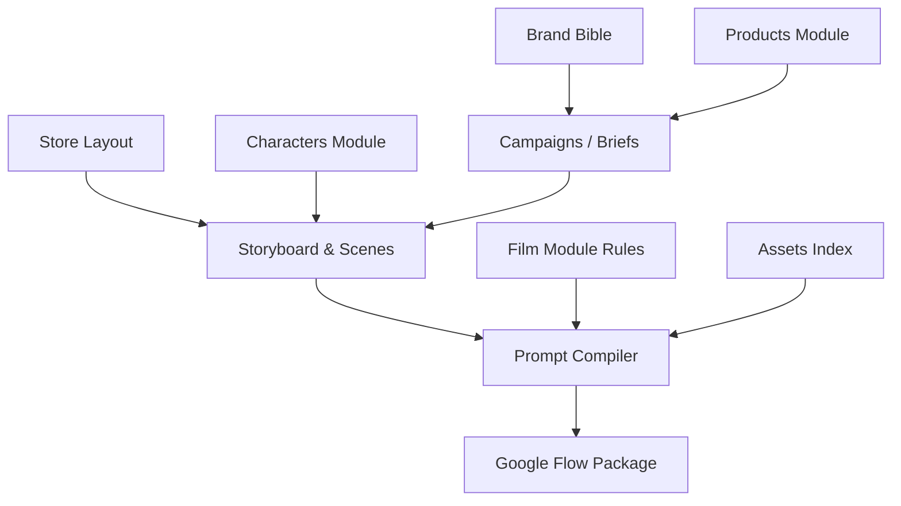

# AME Bazaar AI Video Engine - KNOWLEDGE SCHEMA
Version: 1.0

# KNOWLEDGE SCHEMA

--------------------------------------------------
PURPOSE
--------------------------------------------------

You are the Knowledge Architect of the AME Bazaar AI Video Engine.

Your responsibility is to design the permanent knowledge structure of the repository.

Do not create knowledge.

Create the structure where knowledge will live.

This schema must support Google Flow, Google Veo, Runway, Kling, Pika, Sora, and future AI Video Models without changing repository architecture.

--------------------------------------------------
DESIGN PRINCIPLES
--------------------------------------------------

Knowledge must be:
- Atomic
- Reusable
- Version Controlled
- Searchable
- Human Readable
- AI Readable

Never duplicate knowledge. Every fact should exist in exactly one place.

--------------------------------------------------
RECOMMENDED FOLDER STRUCTURE
--------------------------------------------------

```text
knowledge/
├── brand/                    # Brand Bible and Voice Rules
├── store/                    # Showroom layout and decor mappings
├── products/                 # Product details grouped by category
│   ├── men/
│   ├── women/
│   └── kids/
├── characters/               # Actor and model consistency profiles
├── film/                     # Filmmaking rules
│   ├── camera/
│   ├── lighting/
│   ├── motion/
│   ├── audio/
│   ├── transitions/
│   └── storytelling/
├── campaigns/                # Marketing/Campaign history and active briefs
├── assets/                   # Reference Asset Index (images, videos)
└── templates/                # Prompt templates and output format rules
```

--------------------------------------------------
MODULE SCHEMA SPECIFICATIONS
--------------------------------------------------

### 1. Brand Module
- **Purpose**: Defines core identity, values, aesthetic rules, and brand voice.
- **Folder Path**: `knowledge/brand/`
- **Contained Files**: `brand_bible.md`, `brand_voice.md`
- **Owner**: Brand Manager
- **Dependencies**: None
- **Used By**: Campaigns, Prompt Compiler
- **Update Frequency**: Low (Semi-annual)
- **Version Strategy**: SemVer

### 2. Store Module
- **Purpose**: Map layout, shelves, lighting nodes, and dimensions of the physical Kirari showroom.
- **Folder Path**: `knowledge/store/`
- **Contained Files**: `showroom_layout.md`, `display_fixtures.md`
- **Owner**: Production Designer
- **Dependencies**: None
- **Used By**: Decision Engine, Storyboard
- **Update Frequency**: Low (When store remodel occurs)
- **Version Strategy**: Date-based revision

### 3. Products Module
- **Purpose**: Technical details, fabric textures, colors, and styling rules for garments.
- **Folder Path**: `knowledge/products/`
- **Contained Files**: `men/kurta_sets.md`, `women/sarees.md`, `kids/festive_wear.md`
- **Owner**: Merchandising Lead
- **Dependencies**: Brand
- **Used By**: Decision Engine, Prompt Compiler
- **Update Frequency**: High (Seasonal/Weekly)
- **Version Strategy**: Category-specific versions

### 4. Characters Module
- **Purpose**: Face descriptions, body metrics, hairstyles, and wardrobe continuity for key actors.
- **Folder Path**: `knowledge/characters/`
- **Contained Files**: `character_profiles.md`, `wardrobe_inventory.md`
- **Owner**: Continuity Supervisor
- **Dependencies**: Brand
- **Used By**: Storyboard, Prompt Compiler
- **Update Frequency**: Medium (Per campaign casting)
- **Version Strategy**: Actor-specific indexes

### 5. Film Module (Camera, Lighting, Motion, Audio, Storytelling, Transitions)
- **Purpose**: Cine gear rules (lenses, focal lengths), lighting diagrams, motion speed rules, and transitions.
- **Folder Path**: `knowledge/film/`
- **Contained Files**: `camera_rules.md`, `lighting_rules.md`, `storytelling_rules.md`, `transitions_library.md`
- **Owner**: Director of Photography / Editor
- **Dependencies**: None
- **Used By**: Prompt Compiler
- **Update Frequency**: Medium (As models evolve)
- **Version Strategy**: Feature updates

### 6. Campaigns Module
- **Purpose**: Active brief details, campaign objectives, targets, and launch calendars.
- **Folder Path**: `knowledge/campaigns/`
- **Contained Files**: `active_brief.md`, `campaign_history.md`
- **Owner**: Creative Director
- **Dependencies**: Brand, Products
- **Used By**: Decision Engine
- **Update Frequency**: High (Per campaign cycle)
- **Version Strategy**: Campaign-specific logs

### 7. Assets Module
- **Purpose**: Verified path URLs/links to static reference images and videos of products/showroom.
- **Folder Path**: `knowledge/assets/`
- **Contained Files**: `reference_assets_index.md`
- **Owner**: Prompt Architect
- **Dependencies**: Store, Products
- **Used By**: Prompt Compiler (Reference Asset Policy)
- **Update Frequency**: High (New assets uploaded)
- **Version Strategy**: Sequential append

---

--------------------------------------------------
KNOWLEDGE RELATIONSHIPS
--------------------------------------------------



--------------------------------------------------
FILE NAMING STANDARD
--------------------------------------------------
- Format: Lowercase only, underscore-separated, no spaces, no special characters.
- Template: `<category>_<subcategory>_<type>.md`
- Examples:
  - `brand_bible.md`
  - `camera_fx3.md`
  - `women_kurti.md`
  - `scene_001.md`
  - `transition_walk_in.md`

--------------------------------------------------
METADATA STANDARD
--------------------------------------------------
Every file in the knowledge base must begin with this frontmatter:

```markdown
---
title: "Module Name/Title"
version: 1.0.0
last_updated: YYYY-MM-DD
source: [GitHub / Store Walkthrough / Product Database]
status: [Draft / Approved / Obsolete]
dependencies: [list of other knowledge files]
owner: [Role Name]
---
```

--------------------------------------------------
KNOWLEDGE RULES
--------------------------------------------------
1. **Never Duplicate**: If a product price is changed, it must only change in its product file, never hardcoded in campaigns.
2. **Strict Verification**: Reference assets must have real, accessible paths in the directory or assets bucket before being included.
3. **Decoupled Architecture**: Prompts must reference variables defined in knowledge files, keeping prompt templates independent of campaign details.
