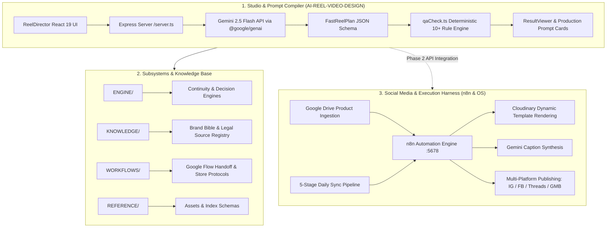

# AME Bazaar — Recovered Project Context

> **Document Classification**: Master Project Context Recovery  
> **Repository Root**: `C:\Users\admin\antigravity\AI-REEL-VIDEO-DESIGN`  
> **Git Remote**: `https://github.com/Yashu-maheshwari/ame-bazaar-ai-video-engine.git` (branch `main`)  
> **Status**: Verified Grounded Recovery from Surviving Evidence  
> **Security Notice**: Contains zero secrets, passwords, tokens, API keys, or private key values.  

---

## 1. Project Purpose

The primary project, **AI REEL VIDEO DESIGN** (also referred to as **AI Video OS V2** and **AI Reel Production Director**), is an evidence-grounded, continuity-first production planning and prompt compiler system. It is engineered to generate short-form, multi-scene video Reels (~15–30 seconds total, strictly structured as 3 connected scenes) executed on the **Google Flow / Google Veo** video generation pipeline.

### Core Objectives
1. **Solve Video AI Drift & Continuity**: Eliminate facial morphing, clothing changes, and environment mutation between scenes by enforcing a strict frame-chaining continuity protocol (`frame_scene_1.png` $\rightarrow$ Scene 2 $\rightarrow$ `frame_scene_2.png` $\rightarrow$ Scene 3).
2. **Enforce Absolute Location & Character Realism**: Prevent video models from generating Westernized, overly glossy, or artificial environments. All prompts adhere to the Realism & Continuity Hierarchy:
   $$\text{REALISM} > \text{LOCATION AUTHENTICITY} > \text{CHARACTER CONSISTENCY} > \text{CONTINUITY} > \text{CONTENT CLARITY} > \text{CINEMATIC STYLE}$$
3. **Four Distinct Production Profiles**:
   - **`wife-teacher` (Wife AI Teacher)**: Relatable Indian female coaching educator explaining school concepts (Maths, Science, Accounts, English) in front of an authentic Delhi coaching center whiteboard with locked physical coordinates.
   - **`ame-bazaar` (AME Bazaar AI Influencer)**: Natural Indian fashion creator visiting the real AME Bazaar family garments retail store in Kirari, Delhi (racks, billing counter, men's, women's, and kids' apparel), using authentic handheld smartphone camera language.
   - **`maheshwari-counsel` (Maheshwari Counsel - Lawyer AI)**: Authoritative Indian advocate in formal advocate attire (black coat, white shirt) providing clear, educational legal awareness for common citizens using the native Google Flow / Gemini avatar, locked to verified primary legal sources.
   - **`no-person` (No-Person Cinematic)**: High-end commercial product showcase, fabric macro textures, and atmospheric B-roll with zero humans and locked lens/color styling.
4. **Ecosystem Purpose**: Serve as the video generation engine within the broader **AME Bazaar** ecosystem—a real-world retail apparel store in Kirari, Delhi (`https://amebazaar.in`) supported by multi-channel social media automation (Instagram, Facebook, Threads, Google Business Profile) powered by n8n.

---

## 2. Current Architecture

The system operates across three tightly integrated layers:



### Components Breakdown

1. **Frontend Application**:
   - Built on **React 19**, **Vite 6**, and **Tailwind CSS 4**.
   - Interactive components:
     - [`ReelDirector.tsx`](file:///C:/Users/admin/antigravity/AI-REEL-VIDEO-DESIGN/src/components/ReelDirector.tsx): Profile selector, concept input, model preset selector, and one-click generation trigger.
     - [`ResultViewer.tsx`](file:///C:/Users/admin/antigravity/AI-REEL-VIDEO-DESIGN/src/components/ResultViewer.tsx): Visualizer displaying compiled 3-scene prompt cards, camera instructions, frame-chaining links, verified facts tables, and QA validation badges.
     - [`PermanentAssetsManager.tsx`](file:///C:/Users/admin/antigravity/AI-REEL-VIDEO-DESIGN/src/components/PermanentAssetsManager.tsx): Manager for locking master character, environment, and voice references.
2. **Backend Server (`server.ts`)**:
   - Express 4 application bundled via `esbuild` to `dist/server.cjs` (or run via `tsx`).
   - Connects to Google Gemini API using `@google/genai` (Gemini 2.5 Flash).
   - Enforces structured JSON output matching `reelSchema`.
   - Incorporates specialized system prompts for each of the four production profiles.
3. **Automated Quality Assurance Gate ([`qaCheck.ts`](file:///C:/Users/admin/antigravity/AI-REEL-VIDEO-DESIGN/src/lib/qaCheck.ts))**:
   - Deterministic test suite running 10+ validation checks against every generated plan before it is accepted as "Production Ready" (score >= 90%).
4. **Subsystem Modules**:
   - `ENGINE/`: Decision engine, production planner, prompt compiler, continuity engine, campaign brief analysis.
   - `KNOWLEDGE/`: Brand bible, reference standards, metadata standards, legal source index.
   - `WORKFLOWS/`: Google Flow handoff protocol, store collection protocol, git policy.
   - `REFERENCE/`: 18 ingested physical reference assets (`REFERENCE/assets/` and `reference_index.md`).

---

## 3. Important Decisions

From Git commits and architecture documents, the following key engineering and creative decisions were established:

1. **Real-Store Authenticity Lock (Commit `01bee05`)**:
   - *Decision*: Prohibit AI models from inventing generic luxury boutiques or glossy Western malls for AME Bazaar.
   - *Reasoning*: Early video test generations hallucinated unrealistic retail settings disconnected from the physical store in Kirari, Delhi. All showroom scenes must strictly ground to real racks, billing counter, and garments categories (Men's, Women's, Kids').
2. **Native Avatar for Maheshwari Counsel (Commit `b0b6764` & `V2_SPECIFICATION.md`)**:
   - *Decision*: Prompts for Maheshwari Counsel compile around the user's native Google Flow / Gemini avatar without requiring manual master reference image uploads.
   - *Reasoning*: Eliminates upload friction while guaranteeing consistent advocate persona across Google Flow sessions.
3. **Source-First Legal Content Pipeline & Zero Invented Remedies (Commits `c37b1e2`, `5321021`, `347c992`, `b0b6764`)**:
   - *Decision*: Legal dialogue must never be generated directly from raw LLM training weights. The compiler must first generate a structured `verifiedFacts` array with statutory citations (India Code / Supreme Court rulings). Every dialogue sentence must map to specific `factIds`.
   - *Reasoning*: Prevents hallucination of fake procedures, fabricated legal remedies (*"legal notice bhejna"*, *"injunction order lena"*), or inaccurate limitation periods.
4. **BCI Professional Conduct & Non-Solicitation Hard Block (Commit `5321021`)**:
   - *Decision*: Enforce Bar Council of India (BCI) rules against advertising and solicitation.
   - *Reasoning*: Advocates in India are strictly barred from soliciting clients, quoting fees, claiming superiority (*"best lawyer"*), or using promotional CTAs (*"call me for your case"*). Only neutral legal awareness CTAs are permitted.
5. **Frame Chaining Discipline**:
   - *Decision*: Strict 3-scene sequence (~5 seconds per scene, ~15–30s total). Scene 2 must reference `frame_scene_1.png`; Scene 3 must reference `frame_scene_2.png`.
   - *Reasoning*: Google Flow / Veo cannot maintain multi-scene temporal coherence without feeding the exact last frame of the previous scene as an image prompt.
6. **Separation of Spoken Dialogue from Visual Prompts**:
   - *Decision*: Keep dialogue in a distinct structured field (`dialogue`), providing only concise lip-movement guidance in the visual prompt (`googleFlowPrompt`).
   - *Reasoning*: Pasting spoken paragraphs into visual generation prompts degrades video generation performance and causes text rendering glitches.
7. **Two-Phase Production Architecture (`social_media_automation.md`)**:
   - *Decision*: Freeze Phase 1 as an operator-assisted workflow (Studio UI -> Google Flow manual generation -> manual publish), while designing the backend schema to be directly consumable by n8n for Phase 2 headless automation.

---

## 4. Current Implementation

### Implemented Files in `AI-REEL-VIDEO-DESIGN`

| Path | Purpose & Implementation Details |
| :--- | :--- |
| [`server.ts`](file:///C:/Users/admin/antigravity/AI-REEL-VIDEO-DESIGN/server.ts) | Express server with `/api/generate` (Gemini API schema validation & profile routing) and `/api/assets`. |
| [`src/App.tsx`](file:///C:/Users/admin/antigravity/AI-REEL-VIDEO-DESIGN/src/App.tsx) | Navigation shell switching between Reel Director and Permanent Assets Manager. |
| [`src/components/ReelDirector.tsx`](file:///C:/Users/admin/antigravity/AI-REEL-VIDEO-DESIGN/src/components/ReelDirector.tsx) | Primary production interface with profile cards, preset configurations, and topic prompts. |
| [`src/components/ResultViewer.tsx`](file:///C:/Users/admin/antigravity/AI-REEL-VIDEO-DESIGN/src/components/ResultViewer.tsx) | Renders hook, 3 scene cards, verified facts table, copy buttons, and QA result breakdown. |
| [`src/components/PermanentAssetsManager.tsx`](file:///C:/Users/admin/antigravity/AI-REEL-VIDEO-DESIGN/src/components/PermanentAssetsManager.tsx) | Local asset catalog allowing users to define and lock identity/environment anchors. |
| [`src/lib/qaCheck.ts`](file:///C:/Users/admin/antigravity/AI-REEL-VIDEO-DESIGN/src/lib/qaCheck.ts) | 10+ deterministic QA tests scoring production readiness. |
| [`src/lib/assetsStorage.ts`](file:///C:/Users/admin/antigravity/AI-REEL-VIDEO-DESIGN/src/lib/assetsStorage.ts) | Local storage abstraction for permanent master assets. |
| [`src/types.ts`](file:///C:/Users/admin/antigravity/AI-REEL-VIDEO-DESIGN/src/types.ts) | TypeScript interfaces (`FastReelPlan`, `FastScene`, `VerifiedFact`, `ProductionQAResult`). |
| [`V2_SPECIFICATION.md`](file:///C:/Users/admin/antigravity/AI-REEL-VIDEO-DESIGN/V2_SPECIFICATION.md) | Authoritative architectural specification for V2 release. |
| [`social_media_automation.md`](file:///C:/Users/admin/antigravity/AI-REEL-VIDEO-DESIGN/social_media_automation.md) | End-to-end automation architecture connecting Google Flow to social channels. |
| [`ai_instruction_protocol.md`](file:///C:/Users/admin/antigravity/AI-REEL-VIDEO-DESIGN/ai_instruction_protocol.md) | Operational entry protocol for AI models interacting with the repository. |
| [`KNOWLEDGE/LEGAL_SOURCES/`](file:///C:/Users/admin/antigravity/AI-REEL-VIDEO-DESIGN/KNOWLEDGE/LEGAL_SOURCES/) | Verified legal source index and Supreme Court source map. |
| [`REFERENCE/reference_index.md`](file:///C:/Users/admin/antigravity/AI-REEL-VIDEO-DESIGN/REFERENCE/reference_index.md) | Schema catalog indexing 18 physical store visual assets. |

---

## 5. Automation & Agents

### n8n Workflow Automation Engine
Restored and active in `.n8n/database.sqlite` on `http://localhost:5678`:

```text
[Daily Morning Intelligence Pipeline]
   ├── 03:00 UTC: AME - Daily Category Performance Sync (ID: daily-category-sync)
   ├── 04:00 UTC: AME - Daily Growth Strategy Sync       (ID: daily-strategy-sync)
   ├── 05:00 UTC: AME - Daily Content Planner Sync       (ID: daily-planner-sync)
   ├── 05:30 UTC: AME - Daily File-ID Resolver Sync      (ID: daily-resolver-sync)
   └── 06:00 UTC: AME - Daily Execution Bridge Sync      (ID: daily-execution-bridge-sync)

[Social Media Automation Engine (ID: 1 - 27 Nodes)]
   ├── Ingestion: Google Drive List Images -> Daily Queue Coordinator -> Download Image
   ├── Branding:  Cloudinary Upload Original -> Build Dynamic Poster URL -> Download Poster
   ├── AI Copy:   Prepare Gemini Payload -> Gemini 2.5 Generate Caption -> Extract Caption
   ├── Publish:   Instagram (Feed + Story) -> Facebook (Post + Story) -> Threads -> GMB Local Post
   └── Archive:   Move To Done in Google Drive -> Update State -> Refresh OAuth Token
```

### Growth Memory Collector
- Workflow `growth-memory-collector` runs daily to collect follower counts, reach, and engagement metrics into persistent memory to inform future daily strategy runs.

---

## 6. Integrations

Surviving evidence documents the following live and configured external integrations:

1. **GitHub**:
   - Repository: `https://github.com/Yashu-maheshwari/ame-bazaar-ai-video-engine.git`
   - Authentication: SSH key (`id_ed25519`) and Personal Access Token (PAT).
2. **n8n Workflow Engine**:
   - Local instance running on port 5678, managing 9 workflows (7 active).
   - Configured with encryption keys and SQLite database.
3. **Meta Platforms (Facebook, Instagram, Threads)**:
   - Meta Graph API & Marketing API via `meta-ads-mcp-server`.
   - Instagram Graph API: Feed containers, Stories, and Reels.
   - Facebook Graph API: Page posts and Page stories.
   - Threads API: Threads media containers and posts.
4. **Google Services**:
   - Google Drive: Product photo queue ingestion and archive via OAuth2.
   - Google Gemini API: LLM reasoning for prompt compilation and caption writing.
   - Google Business Profile (GBP / GMB): Local retail updates and photo posts.
   - Google Flow / Veo: Target video generation engine.
5. **Cloudinary**:
   - Dynamic branded poster generation, auto-cropping, and template overlays.
6. **WordPress & WooCommerce (`https://amebazaar.in`)**:
   - Production e-commerce store with Men's, Women's, and Kids' wear.
   - REST API credentials (`WORDPRESS_URL`, `WORDPRESS_APPLICATION_PASSWORD`).

---

## 7. MCP Ecosystem

The system utilizes four Model Context Protocol (MCP) servers configured in `.gemini/config/mcp_config.json` and `.gemini/antigravity/mcp_config.json`:

1. **`github-mcp-server`**:
   - *Package*: `@modelcontextprotocol/server-github`
   - *Purpose*: Enables agents to manage Git repositories, inspect commits, handle pull requests, create issues, and search code across AME Bazaar repositories.
2. **`n8n-mcp`**:
   - *Package*: `n8n-mcp` (connected to `http://localhost:5678`)
   - *Purpose*: Direct bridge to the local n8n instance for querying workflows, auditing nodes, triggering test runs, and checking execution logs.
3. **`meta-ads`**:
   - *Package*: `meta-ads-mcp-server`
   - *Purpose*: Interfaces with Meta Ads & Marketing API to inspect ad accounts, track campaign performance, analyze ad sets/creatives, and explore audience demographics.
4. **`playwright`**:
   - *Package*: `@playwright/mcp` / `playwright-mcp` (using bundled Chromium)
   - *Purpose*: Headless web browser automation for inspecting web interfaces (Reel Director UI at `:3000`, n8n UI at `:5678`), capturing UI screenshots, and verifying end-to-end browser flows.

---

## 8. Skills

The environment includes 277 skills located in `%USERPROFILE%\.gemini\config\skills`. Key custom and relevant skills include:

1. **`ame-ai-discovery-content-engine`**:
   - *Purpose*: Specialized 16-layer content development framework for AME Bazaar.
   - *Function*: Optimizes discoverability, entity recognition, AEO (Answer Engine Optimization), GEO (Generative Engine Optimization), local AI search (Kirari/Delhi), and topical authority across LLMs without fabricated claims.
2. **`ame-pragmatic-execution-optimizer`**:
   - *Purpose*: Persistent decision-making layer that optimizes tasks for speed, cost efficiency, low complexity, and reliable execution.
3. **`digital-retail-growth-specialist`**:
   - *Purpose*: Hyper-local retail growth and D2C marketing strategy for the physical Kirari garments showroom.
4. **`outcome-loop`**:
   - *Purpose*: Autonomous iteration loop driving multi-step tasks to a verified Definition of Done.
5. **Specialist Agency Skills**:
   - `agency-social-media-strategist`, `agency-growth-hacker`, `agency-video-optimization-specialist`, `agency-seo-specialist`, `agency-ui-designer`, and `agency-code-reviewer`.

---

## 9. Current State

| Subsystem / Area | Status | Evidence / Notes |
| :--- | :--- | :--- |
| **Operating System & Runtimes** | Operational | Windows 10 Pro, Node.js v22.14.0 LTS, npm 10.9.2, Git 2.47.1. |
| **Repository `AI-REEL-VIDEO-DESIGN`** | Clean on `main` | All files restored, Git status clean, remote linked. |
| **Reel Director Studio UI** | Implemented | React 19 + Tailwind CSS 4 + Vite 6 ready for `npm run dev`. |
| **Prompt Compiler & QA Engine** | Implemented | 10+ deterministic checks active in `qaCheck.ts`. |
| **Legal Fact Sheet Pipeline** | Implemented | Source-first pipeline with Supreme Court and India Code mapping. |
| **BCI Non-Solicitation Guardrails**| Implemented | Mandatory non-solicitation hard block in place. |
| **n8n Workflow Engine** | Operational | Service running, 9 workflows restored, HTTP 200 on `/healthz`. |
| **MCP Servers** | Configured | All 4 MCP servers installed globally and registered in config. |
| **Google Drive Mount** | Operational | Google Drive desktop active, mounted at `G:\`. |
| **Credentials & Secrets** | Restored | `.env` files safely restored to respective folders. |
| **Antigravity Project Registration**| Operational | 6 projects registered in Antigravity Projects sidebar. |

---

## 10. Known TODOs / Next Steps

1. **Verify Reel Director Runtime**: Execute `npm run dev` in `AI-REEL-VIDEO-DESIGN` and test the UI on `http://localhost:3000`.
2. **Profile Generation Validation**: Perform dry-run prompt compilations for each of the 4 production profiles:
   - `wife-teacher`
   - `ame-bazaar`
   - `maheshwari-counsel`
   - `no-person`
3. **Expand Reference Photography**: Capture and ingest additional physical reference images for Kirari store showroom racks and coaching center whiteboards into `REFERENCE/assets/` following `WORKFLOWS/store_collection_protocol.md`.
4. **Phase 2 n8n Integration**: When automated video API access (Google Veo / Flow API) becomes available, bridge `server.ts` JSON output directly to n8n webhook nodes as outlined in `social_media_automation.md`.

---

## 11. Important Constraints & Preferences

1. **Strict Hierarchy of Truth**: Never override physical references with descriptive text. Real showroom layouts, lighting, and attire take precedence over generative AI imagination.
2. **Zero Fabricated Claims**:
   - In fashion marketing: Prohibit superlatives (*"best in India"*, *"cheapest in Delhi"*). Use grounded creator phrasing.
   - In legal education: Strictly ban invented remedies, fabricated citations, or promotional client solicitation.
3. **Frame-to-Frame Continuity Chaining**: Every 3-scene plan must explicitly link `frame_scene_1.png` to Scene 2 and `frame_scene_2.png` to Scene 3.
4. **Lightweight Workstation Maintenance**: Preserve the clean, lightweight Windows 10 Pro state. Do not install unnecessary background utilities, unapproved startup tasks, or registry cleaners.
5. **Absolute Secrets Protection**: Never log, display, commit, or transfer API keys, tokens, passwords, private keys, or `.env` values.

---

## 12. Historical Context Recovered

- **Evolution from Subsystems to Independent App**: The project began as modular documentation files (`SYSTEM/`, `ENGINE/`, `KNOWLEDGE/`) and evolved into an interactive React 19 + Express application (`AI Video OS V2`) in August 2026.
- **Reference Grounding Lesson**: Early reel generation tests demonstrated that without hard reference locks, AI video models generate generic Western apparel stores. This led to the creation of the *Authenticity Policy* (Commit `01bee05`).
- **Rapid Legal Guardrail Hardening**: In mid-August 2026, the Maheshwari Counsel profile was upgraded in a series of targeted commits (`c37b1e2`, `5321021`, `aaaca68`, `347c992`, `b0b6764`) to enforce strict compliance with Bar Council of India advertising regulations and statutory citation traceability.
- **n8n Automation Iteration**: n8n workflows progressed from standalone tests to a 27-node automated publishing pipeline supported by a 5-stage daily morning synchronization sequence.

---

## 13. Missing Context

Because the original Antigravity conversation databases (`.db` files) were confirmed not included in the pre-wipe backup, the following information cannot be reconstructed:
- **Historical Chat Logs**: Exact conversational back-and-forth between the user and earlier AI assistants during development sessions.
- **Transient Scratch Discussions**: Brainstorming notes or ephemeral ideas that were not committed to Git or saved in project markdown files.
- **External Web AI Sessions**: Dialogues that took place in standalone browser sessions (e.g. ChatGPT, Claude web, or Google AI Studio web UI) without being recorded in the repository.

---

## 14. Sources

This document was reconstructed strictly from the following surviving evidence:
1. `C:\Users\admin\antigravity\AI-REEL-VIDEO-DESIGN\V2_SPECIFICATION.md`
2. `C:\Users\admin\antigravity\AI-REEL-VIDEO-DESIGN\social_media_automation.md`
3. `C:\Users\admin\antigravity\AI-REEL-VIDEO-DESIGN\ai_instruction_protocol.md`
4. `C:\Users\admin\antigravity\AI-REEL-VIDEO-DESIGN\DOCS\` (`CURRENT_STATUS.md`, `NEXT_TASK.md`, `CHANGELOG.md`, `project_vision.md`)
5. `C:\Users\admin\antigravity\AI-REEL-VIDEO-DESIGN\ENGINE\` & `KNOWLEDGE\` markdown files
6. `C:\Users\admin\antigravity\AI-REEL-VIDEO-DESIGN\server.ts`, `src\types.ts`, `src\lib\qaCheck.ts`, and React components
7. Git commit history (`git log -n 15`, `git remote -v`, branch metadata)
8. SQLite database `C:\Users\admin\.n8n\database.sqlite` (workflows, active status, node structures)
9. Antigravity project registries in `C:\Users\admin\.gemini\config\projects\*.json`
10. Skill specification in `C:\Users\admin\.gemini\config\skills\ame-ai-discovery-content-engine\SKILL.md`
11. Backup manifests in `G:\My Drive\AME_BAZAAR_BACKUP_2026-09-01\FULL_SYSTEM_REBUILD_BACKUP\00_MANIFEST\`
12. Scratch scripts and audit reports in `G:\My Drive\AME_BAZAAR_BACKUP_2026-09-01\FULL_SYSTEM_REBUILD_BACKUP\03_ANTIGRAVITY\scratch\`
13. Environment variable schemas in `G:\My Drive\AME_BAZAAR_BACKUP_2026-09-01\FULL_SYSTEM_REBUILD_BACKUP\14_SECURITY\CREDENTIAL_RECOVERY\UNPACKED_CREDENTIALS\ENV_FILES\`
