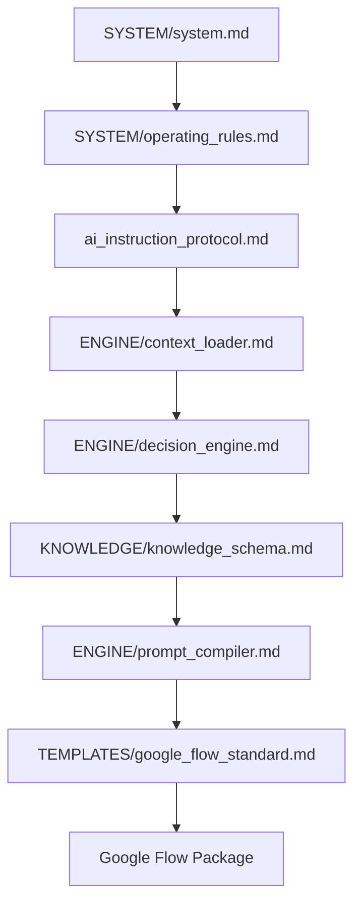

# AME Bazaar AI Video Engine - REPOSITORY MANIFEST
Version: 1.0

# REPOSITORY MANIFEST

--------------------------------------------------
PURPOSE
--------------------------------------------------

This document is the machine-readable index of the entire AI Video Engine. It defines the repository identity, architecture, entry points, module dependencies, and execution order. Every AI assistant must use this file as the first repository index.

--------------------------------------------------
REPOSITORY INFORMATION
--------------------------------------------------
- **Project Name**: AME Bazaar AI Video Engine
- **Repository Name**: `ame-bazaar-ai-video-engine`
- **Version**: 1.0.0
- **Status**: Active / Production-Ready
- **Primary Purpose**: AI-first documentation framework to compile cinematic video production packages.
- **Target AI Models**: ChatGPT, Gemini, Claude, Antigravity, Google Flow, Google Veo, Runway, Kling, Pika, Sora, etc.
- **Primary Output**: Google Flow Prompt package conforming to standard layouts.
- **Repository Type**: Open-source cinematic framework.

--------------------------------------------------
ENTRY POINTS
--------------------------------------------------
- **Primary Entry**: `SYSTEM/system.md`
- **Secondary Entry**: `ai_instruction_protocol.md`
- **Execution Engine**: `ENGINE/`
- **Knowledge Base**: `KNOWLEDGE/`
- **Templates**: `TEMPLATES/`
- **Reference Assets**: `REFERENCE/`
- **Outputs**: `OUTPUT/`

--------------------------------------------------
MODULE INDEX
--------------------------------------------------

| Module Name | Purpose | Location | Depends On | Used By | Status |
| :--- | :--- | :--- | :--- | :--- | :--- |
| **SYSTEM** | Core roles, filmmaking guidelines | `SYSTEM/system.md` | None | Protocol | Active |
| **OPERATING RULES** | Priority search & repository rules | `SYSTEM/operating_rules.md` | None | Protocol | Active |
| **AI PROTOCOL** | Execution sequence entry point | `ai_instruction_protocol.md` | SYSTEM | All AI models | Active |
| **CONTEXT LOADER** | Token-optimized context packaging | `ENGINE/context_loader.md` | SYSTEM | All engines | Active |
| **DECISION ENGINE** | Request analysis & planning | `ENGINE/decision_engine.md` | Context Loader | Prompt Compiler | Active |
| **PROMPT COMPILER** | Google Flow prompt compiler | `ENGINE/prompt_compiler.md` | Decision Engine | Google Flow | Active |
| **KNOWLEDGE SCHEMA** | Database standards | `KNOWLEDGE/knowledge_schema.md` | SYSTEM | Metadata Standard | Active |
| **METADATA STANDARD** | Frontmatter YAML & layouts | `KNOWLEDGE/metadata_standard.md` | Schema | All knowledge files | Active |
| **FLOW STANDARD** | Prompt output layout specs | `TEMPLATES/google_flow_standard.md` | Prompt Compiler | Prompt Compiler | Active |

--------------------------------------------------
EXECUTION GRAPH
--------------------------------------------------

--------------------------------------------------
DEPENDENCY RULES
--------------------------------------------------
1. **Context Loader Mandatory**: No module or assistant may bypass the Context Loader step.
2. **Analysis Required**: No Prompt Compiler execution is permitted without an approved Decision Engine report.
3. **Reference Asset First**: Prompts must utilize Reference Assets if available; text descriptions are secondary.

--------------------------------------------------
AI COMPATIBILITY
--------------------------------------------------
This repository is designed to be interpreted by ChatGPT, Gemini, Claude, Antigravity, and future AI assistants. No module or standard may assume or target a specific AI model's unique syntax outside standard markdown.
